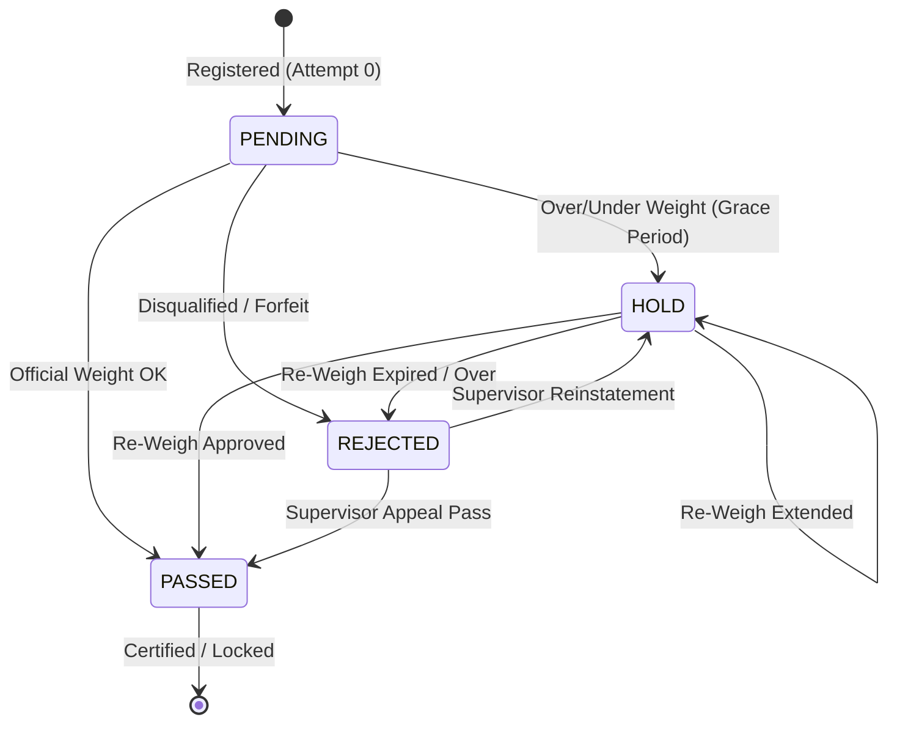

# Taekwondo Weigh-In Management System

A complete, production-ready digital management platform designed specifically for Taekwondo tournament organizers, technical directors, and official weigh-in marshals.

Built with **Next.js 14+ (App Router)**, **TypeScript**, **Tailwind CSS**, and **Prisma ORM**, the system automates participant registration, official weight recording, dynamic multi-level category segregation, strict state machine workflow enforcement, historical attempt tracking, and paper-ready A4 passed athlete roster printing.

---

## 📋 Table of Contents
1. [Core Features](#core-features)
2. [Mandatory Project Documentation](#mandatory-project-documentation)
3. [Business Rules & State Machine](#business-rules--state-machine)
4. [Tech Stack](#tech-stack)
5. [Getting Started (Local Development)](#getting-started-local-development)
6. [Database Strategy (SQLite Dev & PostgreSQL Prod)](#database-strategy)
7. [Running Automated Tests](#running-automated-tests)
8. [A4 Print Certification](#a4-print-certification)
9. [Future Fixture Integration](#future-fixture-integration)

---

## 🥋 Core Features

- **Dashboard:** Real-time metrics from the database (Total Athletes, Passed, Pending, Hold, Rejected, Completion %), division breakdown, gender distribution, and live audit feed.
- **Weigh-In Operator Console:** Touch-optimized interface designed for tablets and laptops with large digital scale readout, quick +/- steppers, on-screen numeric keypad, and fast `[NEXT ATHLETE]` queue resolution.
- **Strict State Machine:** Immutable business rules (`PENDING` → `PASS/HOLD/REJECT`, `HOLD` → `PASS/HOLD/REJECT`, `REJECTED` → `PASS/HOLD`, `PASSED` → locked).
- **Participant Management:** Full CRUD with real-time Zod schema validation and tournament-wide unique LOT number enforcement.
- **Bulk Import Engine:** High-speed CSV and Excel (.XLSX) parser with template generator, pre-import error detection, duplicate LOT isolation, and interactive confirmation preview.
- **Dynamic Category Segregation:** Automatically groups participants by `Gender` → `Division` → `Age Group` → `Category` → `Weight Category` without hardcoded categories.
- **Dedicated Status Views:**
  - **Passed:** Exclusively lists certified athletes with direct print triggers.
  - **Pending / Hold:** Visually segregated holding area with attempt counts.
  - **Rejected:** Disqualification log with supervisor recovery appeal workflows.
- **Tournament-Wide Search:** Global instant modal (`Ctrl+K` or `/`) querying athlete names, LOT numbers, academies, and categories with 1-click weigh-in jump.
- **Dedicated A4 Print Layout:** Formatted to ISO A4 paper with strict quarantine rules: prints **ONLY** Athlete Name and Academy Name of PASSED athletes.

---

## 📁 Mandatory Project Documentation
The project strictly maintains six mandatory project-control documents inside `/docs`:
- [`docs/prd.md`](docs/prd.md): Product Requirements Document (features, user roles, non-functional goals, acceptance criteria).
- [`docs/architecture.md`](docs/architecture.md): Technical system architecture, component hierarchy, data flows, Mermaid diagrams, API specs, and database schema.
- [`docs/rules.md`](docs/rules.md): Immutable business rules and operational source of truth (`RULE-001` through `RULE-025`).
- [`docs/design.md`](docs/design.md): Design system, high-contrast status colors, typography, touch ergonomics, and responsive layout specs.
- [`docs/tasks.md`](docs/tasks.md): Phased development checklist and progress tracker.
- [`docs/memory.md`](docs/memory.md): Persistent architectural decisions, database notes, and conventions.

---

## ⚙️ Business Rules & State Machine



- **RULE-006:** A valid, positive numeric weight is mandatory prior to any status decision.
- **RULE-007:** Weigh-in history must never be deleted or overwritten when status changes.
- **RULE-011:** Athletes in `REJECTED` status can only transition to `PASS` or `HOLD`. The `REJECT` button is suppressed.
- **RULE-012:** `PASSED` status is locked. Normal weigh-in operations do not display alternative action buttons.
- **RULE-019:** The printed document must contain **ONLY** Athlete Name and Academy Name.

---

## 🛠️ Tech Stack
- **Framework:** Next.js 14+ (App Router)
- **Language:** TypeScript
- **Styling:** Tailwind CSS (Dark Sports Timing Console)
- **Database & ORM:** Prisma ORM with SQLite (Development) / PostgreSQL (Production)
- **Spreadsheets:** SheetJS (`xlsx`)
- **Icons:** Lucide React
- **Validation:** Zod

---

## 🚀 Getting Started (Local Development)

### 1. Install Dependencies
```bash
npm install
```

### 2. Initialize Database & Run Seed
```bash
# Push schema to local SQLite database (dev.db)
npx prisma db push

# Seed tournament database with realistic categories and athletes
npx tsx prisma/seed.ts
```

### 3. Start Development Server
```bash
npm run dev
```
Open [http://localhost:3000](http://localhost:3000) in your browser.

---

## 🗄️ Database Strategy

- **Development:** SQLite (`file:./dev.db`) provides zero-configuration, self-contained relational persistence on Windows without external background services.
- **Production Target:** PostgreSQL (via Supabase, Neon, or Vercel Postgres). Swap `provider = "postgresql"` in `prisma/schema.prisma` and set `DATABASE_URL` in `.env`.
- Differences are documented in [`docs/memory.md`](docs/memory.md) and [`docs/architecture.md`](docs/architecture.md).

---

## 🧪 Running Automated Tests
Run the comprehensive automated test suite (state machine, import parsing, database persistence, and history preservation):
```bash
npm test
```

---

## 🖨️ A4 Print Certification
To print certified passed rosters:
1. Navigate to **Passed** or **Print Passed** in the navigation bar.
2. Choose **Print All Passed** or select a specific category and click **Print Category Passed**.
3. The dedicated `@media print` stylesheet automatically formats for ISO A4 portrait and strips all weights, LOT numbers, status labels, headers, and UI controls. Only Athlete Name and Academy Name are printed.

---

## 🔗 Future Fixture Integration
The application exposes `/api/export/fixtures` which returns certified `PASSED` athlete rosters organized into category brackets compatible with [tkdfixture.vercel.app](https://tkdfixture.vercel.app/).
