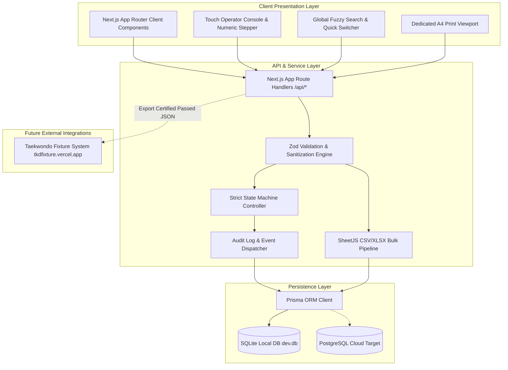
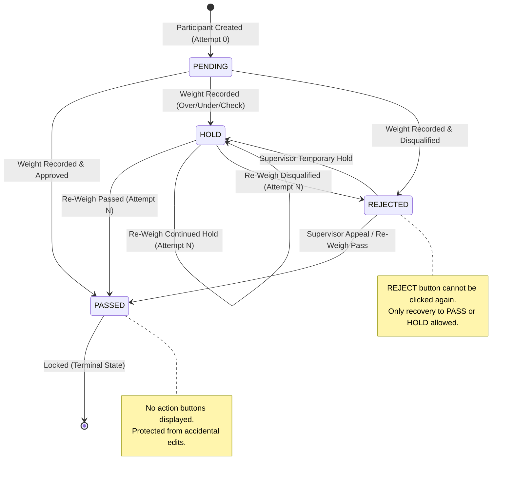
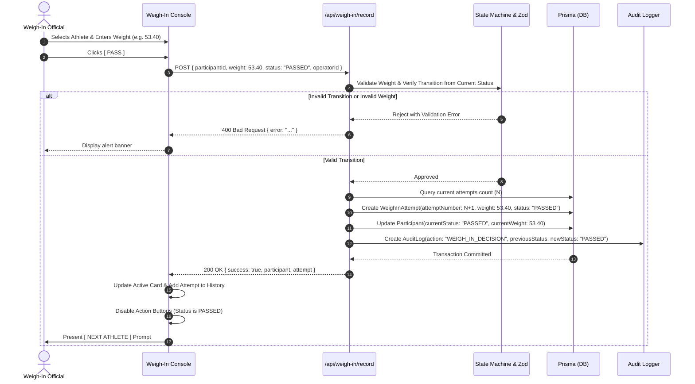
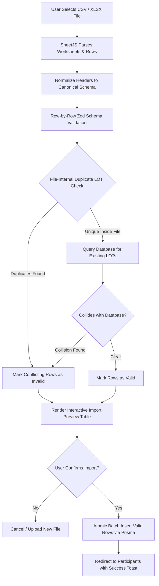
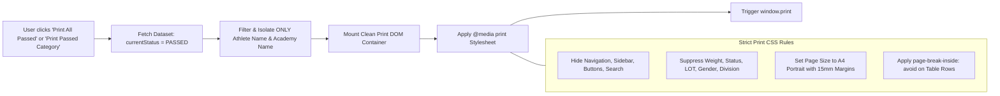

# System Architecture Document
# Taekwondo Tournament Weigh-In Management System

## 1. Overall System Architecture
The Taekwondo Weigh-In Management System is architected as a high-performance, single-tenant / tournament-focused web application built on **Next.js 14+ (App Router)**, **TypeScript**, **Tailwind CSS**, and **Prisma ORM**.

The system utilizes a client-server monolithic design where the frontend interacts with server endpoints via RESTful API routes and typed Next.js server actions. Data persistence is managed through Prisma ORM, targeting **SQLite** for development/testing (zero background service requirement on Windows) and **PostgreSQL** for cloud production deployment (Supabase, Neon, or Vercel Postgres).



---

## 2. Frontend Architecture
The frontend is constructed using React 18+ inside the Next.js App Router paradigm (`src/app`), styled with Tailwind CSS and enhanced with Lucide React icons.

### 2.1 Directory Organization
```text
src/
├── app/
│   ├── layout.tsx              # Root shell, font loaders, global providers
│   ├── page.tsx                # Dashboard view with tournament stats
│   ├── participants/           # Participant roster, manual entry, edit modal
│   ├── import/                 # Multi-step CSV/XLSX bulk import pipeline
│   ├── weigh-in/               # Weigh-in operator console & queue
│   ├── search/                 # Dedicated search page
│   ├── passed/                 # Passed athletes view & Print trigger
│   ├── pending/                # Pending and Hold queue view
│   ├── rejected/               # Disqualified / Rejected recovery view
│   ├── print/                  # Dedicated clean A4 print route
│   └── api/                    # Backend API route handlers
├── components/
│   ├── ui/                     # Reusable design primitives (Button, Card, Badge, Modal, Input)
│   ├── layout/                 # Sidebar, Header, GlobalSearchModal, Breadcrumbs
│   ├── weigh-in/               # Keypad, ActiveAthleteCard, HistoryDrawer, Stepper
│   ├── import/                 # Dropzone, FilePreview, ValidationTable
│   └── print/                  # PrintRosterTable, A4SheetContainer
├── lib/
│   ├── prisma.ts               # Global Prisma client singleton
│   ├── state-machine.ts        # Immutable state transition engine
│   ├── category-engine.ts      # Multi-level category hierarchy generator
│   └── validation.ts           # Zod schemas for participants, attempts, imports
├── types/                      # TypeScript definitions and enums
└── hooks/                      # Custom hooks (useWeighIn, useSearch, useKeyboardShortcuts)
```

### 2.2 Component Hierarchy (Weigh-In Console)
```text
<WeighInPage>
  ├── <CategoryBar> (Current category title, progress bar, counters)
  ├── <QueueNavigation> (Category selector dropdown, Lot switcher)
  ├── <OperatorSplitLayout>
  │     ├── <ActiveAthleteCard>
  │     │     ├── <AthleteMetadata> (LOT, Name, Academy, Category info)
  │     │     ├── <WeightInputSection>
  │     │     │     ├── <NumericDisplayInput>
  │     │     │     ├── <QuickAdjustmentSteppers> (+0.1, -0.1, +0.5, -0.5)
  │     │     │     └── <TouchKeypad> (0-9, ., DEL, CLR)
  │     │     ├── <StatusActionPanel> (PASS, HOLD, REJECT - dynamic by state)
  │     │     └── <NextAthleteButton> (Advances to next unresolved)
  │     └── <WeighInHistoryDrawer>
  │           └── <AttemptTimelineItem[]> (Attempt 1, 2, timestamps, notes)
  └── <CategoryCompletionModal> (Shown when all athletes are resolved)
```

---

## 3. Backend & API Architecture
The backend is exposed via RESTful Next.js Route Handlers (`src/app/api/`) returning consistent JSON payloads with HTTP status codes and uniform error handling.

### 3.1 Endpoint Matrix
| Route | Method | Purpose | Auth / Role Required |
| :--- | :--- | :--- | :--- |
| `/api/participants` | `GET` | List participants with search, status, & category filters | `VIEW_ONLY` / `OPERATOR` |
| `/api/participants` | `POST` | Create a new participant with validation | `ADMIN` / `OPERATOR` |
| `/api/participants/[id]` | `GET` | Fetch single participant details with attempts | `VIEW_ONLY` / `OPERATOR` |
| `/api/participants/[id]` | `PUT` | Update participant details | `ADMIN` / `OPERATOR` |
| `/api/participants/[id]` | `DELETE` | Delete participant (protected if attempts exist) | `ADMIN` |
| `/api/participants/import` | `POST` | Batch import validated participant rows | `ADMIN` / `OPERATOR` |
| `/api/categories` | `GET` | Retrieve dynamic category tree with status counts | `VIEW_ONLY` / `OPERATOR` |
| `/api/weigh-in/record` | `POST` | Record a weigh-in attempt & update status | `OPERATOR` / `ADMIN` |
| `/api/weigh-in/next` | `GET` | Fetch next unresolved athlete in category | `OPERATOR` / `ADMIN` |
| `/api/weigh-in/history/[id]`| `GET` | Retrieve all historical attempts for participant | `VIEW_ONLY` / `OPERATOR` |
| `/api/passed` | `GET` | Fetch exclusively passed athletes (for print & export) | `VIEW_ONLY` / `OPERATOR` |
| `/api/dashboard/stats` | `GET` | Tournament-wide aggregated statistics & completion % | `VIEW_ONLY` / `OPERATOR` |
| `/api/audit-logs` | `GET` | Chronological audit trail of all status actions | `ADMIN` |

---

## 4. Database Architecture & Schema

### 4.1 Relational Data Model (Prisma Schema)
```prisma
datasource db {
  provider = "sqlite" // Configured for SQLite dev, PostgreSQL ready for prod
  url      = env("DATABASE_URL")
}

generator client {
  provider = "prisma-client-js"
}

enum Status {
  PENDING
  HOLD
  PASSED
  REJECTED
}

enum Gender {
  MALE
  FEMALE
}

model Participant {
  id              String           @id @default(cuid())
  lotNumber       String           @unique
  athleteName     String
  academyName     String
  gender          Gender
  division        String
  ageGroup        String
  category        String
  weightCategory  String
  athleteId       String?
  currentStatus   Status           @default(PENDING)
  currentWeight   Float?
  createdAt       DateTime         @default(now())
  updatedAt       DateTime         @updatedAt

  attempts        WeighInAttempt[]
  auditLogs       AuditLog[]

  @@index([currentStatus])
  @@index([gender, division, category, weightCategory])
  @@index([academyName])
}

model WeighInAttempt {
  id              String       @id @default(cuid())
  participantId   String
  participant     Participant  @relation(fields: [participantId], references: [id], onDelete: Cascade)
  attemptNumber   Int
  weight          Float
  status          Status
  operatorId      String       @default("OP-01")
  notes           String?
  weighedAt       DateTime     @default(now())
  createdAt       DateTime     @default(now())

  @@index([participantId])
  @@index([weighedAt])
}

model AuditLog {
  id              String       @id @default(cuid())
  participantId   String
  participant     Participant  @relation(fields: [participantId], references: [id], onDelete: Cascade)
  action          String
  previousStatus  Status
  newStatus       Status
  weight          Float?
  operatorId      String       @default("OP-01")
  details         String?
  timestamp       DateTime     @default(now())

  @@index([participantId])
  @@index([timestamp])
}
```

---

## 5. Weigh-In Status State Machine
The core business logic is governed by an immutable finite state machine (FSM).



### State Machine Transition Rules
1. **Weight Pre-condition:** Any transition to `PASSED`, `HOLD`, or `REJECTED` **requires** a valid numeric float weight between `10.00` and `200.00 kg`.
2. **`PENDING`:** Initial state for every newly created or imported athlete. Allowed outgoing transitions: `PASSED`, `HOLD`, `REJECTED`.
3. **`HOLD`:** Athlete failed initial weight requirement but is granted time for re-weigh within official schedule. Allowed outgoing transitions: `PASSED`, `HOLD`, `REJECTED`.
4. **`REJECTED`:** Disqualified athlete (e.g. over category limit after grace period). Allowed outgoing transitions: `PASSED` or `HOLD` only (recovery). The `REJECT` button is never presented.
5. **`PASSED`:** The athlete made official weight. Action buttons (`PASS`, `HOLD`, `REJECT`) are completely suppressed.

---

## 6. Data Flows

### 6.1 Participant Weigh-In Flow


### 6.2 Bulk Import Pipeline Flow


### 6.3 Dedicated A4 Printing Architecture


---

## 7. Security & Authorization Architecture
- **Input Sanitization:** All payload strings are stripped of HTML/script tags; strict Zod schema validation blocks prototype pollution and payload injection.
- **ORM Parameterization:** Prisma uses parameterized SQL queries exclusively, eliminating SQL injection.
- **RBAC Enforcement:** Role-based checks guard mutating API routes (`ADMIN` for participant deletion and settings; `WEIGH_IN_OPERATOR` for weight recording).
- **Environment Isolation:** Zero credentials exposed to frontend code. Database connection strings reside in `.env`.

---

## 8. Deployment Architecture
- **Vercel / Node Server Compatibility:** The Next.js App Router codebase is fully serverless and edge-compatible.
- **Database Scalability:** Zero-migration friction from development SQLite (`dev.db`) to managed PostgreSQL (`Supabase`, `Neon`, or `AWS RDS`) by swapping the Prisma provider and executing `prisma migrate deploy`.

---

## 9. Future Integration (Fixture / Bracket System)
The participant model maps 1:1 to the required seeding input of [tkdfixture.vercel.app](https://tkdfixture.vercel.app/).
An export endpoint `/api/export/fixtures` provides certified `PASSED` rosters partitioned by category, allowing instant bracket generation without manual re-entry.
